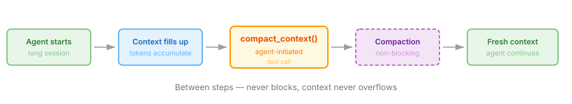

# opencode-agent-compaction



**The agent compresses its own context — mid-work, automatically, non-blocking.**

Agent-triggered context compaction for OpenCode: the agent calls the built-in `compact_context` tool between steps, so the **standard OpenCode compaction** runs mid-task and the agent continues where it left off. No custom compaction logic — just a thin wrapper around the built-in mechanism.

## Quick Start

1. Copy [`plugins/compact-context.ts`](plugins/compact-context.ts) into `~/.config/opencode/plugins/` (global) or `.opencode/plugins/` (project).
2. Restart OpenCode.

The agent now has the `compact_context` tool, which fires the compaction asynchronously — the running loop compacts between steps and the agent continues without pausing.

## Agent Prompt Example

Add to your `<agent>.md` to let a long-running agent compact its own context as it goes (adjust the wording to your needs):

```
Before continuing to the next step, compact the current session's context:
    - Call the `compact_context` tool — compaction runs asynchronously between steps, work continues automatically.
    - After compaction — re-read the plan and reload your skills.
```

## The optional `reason` parameter

The tool accepts a single optional parameter — `reason`, a short note on why compaction was requested. The agent may use it to record the intent:

```
compact_context(reason: "context too large, need to free tokens for the next phase")
```

## Why

OpenCode compacts context automatically on overflow, but the agent has no control over when it happens. This plugin gives the agent that control — without ever blocking its own run.

Tested with OpenCode **1.17.18**.
